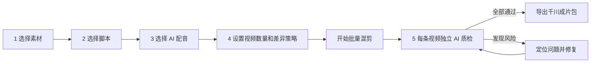

# 2026 千川成片生产台设计说明

## 1. 产品第一性原则

软件的最终目标不是“自动剪出一个视频”，而是稳定产出一批能够进入抖音千川商品卡投放流程的合规竖屏成片。

所有产品决策服从以下顺序：

1. 画面、文案、口播和商品信息必须相互对应。
2. 未通过发布前检查的成片不能进入正式导出目录。
3. 原视频永不被覆盖，素材、脚本、工程、成片和报告都可追溯。
4. 自动化结果必须能定位问题、人工复核和重新执行。
5. 所有正式成片统一导出为 `1080×1920`、`9:16`。
6. 批量生成不能以牺牲单条质量为代价，每一条视频都要独立检查。

## 2. 一级业务架构保持不变

| 模块 | 作用 |
|---|---|
| 原素材处理 | 导入、切分、分类、清除字幕、按款号保存 |
| 素材管理 | 查找、预览、整理、删除并维护素材引用 |
| 剪辑成片 | 选材、选脚本、AI 配音、设置数量、混剪、AI 质检和导出 |
| 脚本管理 | 管理镜头结构、口播文案、素材分类槽位和文案预检 |

新增能力集中在“剪辑成片”，不增加无必要的一级窗口。

## 3. 千川成片五步流程



### 3.1 选择素材

- 只允许正式素材库中时长 `≥ 2.000 秒` 的可用片段进入候选池。
- 显示人物穿搭、细节讲解、测评讲解等脚本分类的覆盖情况。
- 删除时间线片段只删除当前工程引用，不删除素材库文件。

### 3.2 选择脚本

- 脚本来自脚本管理模块，更新后实时同步。
- 进入生成前先执行文案预检，检查疑似极限表达、违禁词、承诺性用语和商品信息冲突。
- 删除脚本引用不删除脚本模板。

### 3.3 AI 配音

- 提供中文 AI 声音试听和选择。
- 支持添加自定义配音；添加后的每个文件均提供删除按钮。
- 口播出现时自动压低背景音乐。

### 3.4 生成设置

- 一次生成 `1–20` 条成片。
- 可启用素材顺序变化、前三秒开场变化、音乐起点变化和字幕版式微调。
- 每条成片独立生成、独立质检、独立报告。
- 正式输出规格固定为：

| 参数 | 固定值 |
|---|---|
| 画幅 | 9:16 竖屏 |
| 分辨率 | 1080×1920 |
| 容器 | MP4 |
| 视频编码 | H.264 高质量 |
| 帧率 | 30 fps |
| 音频编码 | AAC · 48 kHz |

### 3.5 AI 质检与导出

每条成片必须完成四类检查：

1. 画面与文案一致：商品、颜色、版型、动作、卖点和镜头语义对应。
2. 口播与字幕一致：检测漏读、错读、字幕缺字和时间错位。
3. 风险词与承诺表达：标记疑似极限词、违禁词和无法证明的效果承诺。
4. 抖音投放适配：根据版本化规则库生成风险结果，并保留人工复核入口。

质检结果必须包含问题类型、时间点、证据、建议修改、模型版本和规则库版本。AI 只作为发布前筛查，不能把“未发现风险”描述成平台审核保证。

## 4. 状态机

```text
草稿 → 配置完整 → 混剪中 → AI质检中
                         ├─ 通过 → 可导出 → 已导出
                         └─ 风险 → 待修复 → 重新质检
```

- “风险”状态禁止导出。
- 一键修复只处理可自动修复项；需要资质或事实确认的问题必须人工处理。
- 删除成片只删除该生成结果和对应报告，不影响素材库、脚本与其他成片。
- 导出目录只写入质检通过的正式文件。

## 5. 2026 中国桌面 UI 方向

- 语言：全部使用直接、可执行的中文动词，不使用技术实现术语作为导航名称。
- 密度：面向 Windows 大屏生产场景，信息密度高但层级明确。
- 视觉：白底黑字、浅灰工作面、薄荷绿表示通过、琥珀色表示待复核、红色只表示阻断或删除。
- 字体：中文使用 Microsoft YaHei UI，数据与时间使用 Bahnschrift / Segoe UI。
- 标志性组件：右侧“AI 发布前闸门”始终显示五项生成条件与四项质检范围。
- 删除：所有可添加的原视频、素材、配音、音乐、脚本、脚本段落和生成成片均有明确删除入口。

## 6. 当前原型验收

- 五步流程均可点击切换。
- AI 声音选择、试听反馈和自定义配音入口有效。
- 生成数量支持 1–20，数量与预计耗时同步变化。
- 测试生成 4 条成片时，2 条通过、2 条被风险闸门拦截。
- 存在风险时导出按钮会阻止操作。
- 一键修复后 4 条全部通过并进入千川导出页。
- 单条质检报告包含四项结果，并保留修复入口。
- 生成成片提供独立删除按钮，删除不影响素材库和脚本。
- 320、768、1024、1440 像素宽度下五个步骤均无横向溢出。
