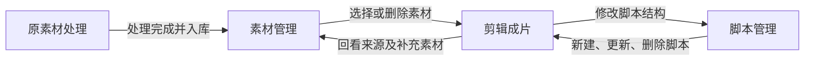

# V1 四模块互联架构与删除规则

## 1. 最终一级导航

V1 只保留四个业务模块；“设置”是系统入口，不参与业务编号。

| 模块 | 负责内容 | 主要输出 |
|---|---|---|
| 1. 原素材处理 | 导入原视频、智能拆分、内容分类、清除原字幕、按款号保存 | 可用素材及处理报告 |
| 2. 素材管理 | 按款号、批次和分类查找、预览、增删素材 | 可供剪辑引用的统一素材库 |
| 3. 剪辑成片 | 选择脚本、画面素材、配音和音乐，生成并导出视频 | 成片工程与导出文件 |
| 4. 脚本管理 | 新建、编辑、复制和删除可复用脚本 | 可供剪辑工程引用的脚本模板 |

## 2. 模块互联

关键同步规则：

- 原素材处理完成后，新片段立即写入素材管理，并保留来源批次、款号、分类、时长和字幕处理状态。
- 素材管理删除正在被未导出工程引用的素材时，必须二次确认；确认后同步移除时间线引用，但不删除原视频。
- 剪辑成片中删除时间线片段，只删除当前工程引用，不删除素材库文件。
- 脚本管理中新建或保存脚本后，剪辑成片的脚本选择器立即刷新。
- 删除正在被工程引用的脚本时，必须二次确认；确认后工程进入“未选择脚本”，其余画面和声音素材保持不变。
- 任一素材进入正式素材库前都必须满足时长 `≥ 2.000 秒`；不足时优先合并同类相邻片段，否则标记不可用。

## 3. 所有可添加对象的删除入口

| 可添加对象 | 删除入口 | 删除范围 |
|---|---|---|
| 原视频 | 原素材处理的视频卡片右上角“删除” | 仅移出当前批次，磁盘原文件保留 |
| 导入队列文件 | 文件行右侧“×” | 仅移出本次导入队列 |
| 正式素材 | 素材管理表格行“删除”或批量“删除所选” | 删除素材库文件，并同步清理未导出工程引用 |
| 时间线画面 | 片段卡片“删除” | 仅删除当前工程引用 |
| 配音 | 配音轨道条目“删除” | 仅移出当前工程 |
| 音乐 | 音乐轨道条目“删除” | 仅移出当前工程 |
| 脚本模板 | 脚本列表“删除” | 删除模板，并清空相关工程的脚本引用 |
| 脚本段落 | 段落行“删除” | 仅从当前脚本结构移除 |

## 4. UI 行为约束

- 四个一级模块始终在左侧导航中可见，当前位置使用黑底白字突出。
- 每个模块顶部只有一个与当前任务相关的主操作按钮。
- 危险删除必须显示对象名称、影响范围和原文件是否保留。
- 所有模块共用同一份素材、脚本和剪辑工程状态，不能出现各页面数据不一致。
- 空状态必须提供下一步入口；操作结果通过状态提示反馈。
- 页面采用白底黑字，薄灰边框，薄荷绿色仅用于完成、可用和当前状态。

## 5. 当前原型验收结果

- 四个一级模块均可切换，标题、编号和顶部主操作同步变化。
- 素材删除已验证：素材库 `7 → 6`，被引用的剪辑时间线 `4 → 3`。
- 脚本新建已验证：脚本管理新建后，剪辑模块数量 `3 → 4`。
- 当前脚本删除已验证：剪辑工程同步进入“未选择脚本”。
- 时间线画面、配音、音乐、脚本和脚本段落均提供独立删除入口。
- 320、768、1024、1440 像素宽度下四模块页面均无横向溢出。
