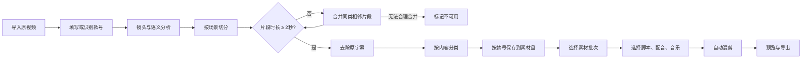

# 抖音带货素材智能管理与混剪软件——项目计划书 v1 草案

> 状态：待确认。本文用于锁定产品范围、关键规则和开发路线；确认后再进入技术拆解与编码。

> 2026-08-17 界面架构更新：V1 一级业务导航固定为“原素材处理、素材管理、剪辑成片、脚本管理”四个互联模块；所有可添加的原视频、正式素材、时间线片段、配音、音乐、脚本及脚本段落均必须提供删除入口。详细规则见《V1四模块互联架构》。

> 2026-08-17 成片流程更新：“剪辑成片”升级为选素材、选脚本、AI 配音、生成数量与差异策略、逐条 AI 质检五步生产线。正式成片固定导出为 1080×1920、9:16；画文、口播字幕、风险词和投放适配未全部通过时禁止导出。详细规则见《2026千川成片生产台设计说明》。

## 1. 项目定位

面向抖音服装带货视频的 Windows 本地桌面软件。用户导入自己拍摄的原视频后，软件在本机完成视频分析、素材切分、原字幕处理、内容分类、按款号归档，并在后续按脚本、配音和音乐自动混剪成可导出视频。

产品原则：

- 本地优先：原视频、素材库、工程文件和导出结果默认保存在用户指定的本地素材盘。
- 原片保护：不直接修改或覆盖导入的原视频。
- 可检查：自动分类、字幕处理和混剪结果都能预览、调整和追溯。
- 批次清晰：每次导入形成独立批次，并绑定款号、日期和处理状态。
- 桌面连续性：后续版本升级保留原安装位置、桌面快捷方式、配置和用户素材数据。

## 2. 目标用户与核心场景

目标用户是服装带货创作者、短视频剪辑人员和小型内容团队。

核心流程：



## 3. 必须遵守的素材切分规则

### 3.1 最短时长

- 任何进入“可用素材库”的最终片段时长不得低于 `2.000 秒`。
- 恰好 `2.000 秒` 的片段允许保存和参与混剪。
- 时长以媒体时间戳（PTS）计算，不以文件名或粗略帧数估算。
- 音视频必须同步裁切，最终文件不得出现黑帧、静音尾巴或音画错位。

### 3.2 自动切分不足 2 秒时

处理优先级：

1. 优先与内容分类相同、时间上相邻的片段合并。
2. 两侧都可合并时，选择语义连续性更高、镜头跳变更小的一侧。
3. 合并后重新判断分类和时长。
4. 无法合理合并时，标记为“时长不足—不可用”，不导出到正式素材目录。
5. 任务报告记录“自动合并数量”和“时长不足淘汰数量”。

### 3.3 手动裁切时

- 片段短于 2 秒时，时长标签变红。
- “保存片段”按钮禁用，并提示“片段不能短于 2 秒”。
- 时间轴拖拽到临界值时吸附到 2 秒，允许用户继续向外扩展。

## 4. v1 产品范围

### 4.1 第一阶段：素材入库与整理（MVP）

- 多视频批量导入。
- 创建处理批次并填写款号。
- 视频基础信息读取与代理预览。
- 镜头切分与最低 2 秒规则。
- 原字幕区域检测与去除/修复。
- 内容分类：人物穿搭、整体展示、细节讲解、测评对比、动作展示、口播、其他。
- 分类结果人工预览、改类、合并、拆分和淘汰。
- 按款号、批次、分类保存到本地素材盘。
- 处理报告与失败重试。

建议目录结构：

```text
素材盘/
└─ 款号/
   └─ YYYY-MM-DD_批次名/
      ├─ 00_原视频/
      ├─ 01_人物穿搭/
      ├─ 02_整体展示/
      ├─ 03_细节讲解/
      ├─ 04_测评对比/
      ├─ 05_动作展示/
      ├─ 06_口播/
      ├─ 90_其他/
      ├─ 99_不可用/
      └─ manifest.json
```

### 4.2 第二阶段：脚本化混剪

- 选择款号和素材批次。
- 选择或编辑混剪脚本。
- 选择配音、背景音乐和音量策略。
- 按脚本槽位自动匹配素材。
- 自动节奏、转场、字幕和画幅适配。
- 时间线预览与片段替换。
- 批量导出多个版本。

### 4.3 暂不纳入 v1

- 云端素材同步与多人协作。
- 手机端应用。
- 自动发布到抖音账号。
- 远程模型训练平台。
- 复杂的专业级多轨剪辑器替代功能。

## 5. 功能模块

| 模块 | 主要职责 | v1 优先级 |
|---|---|---:|
| 工作台 | 批次概览、任务队列、素材统计、快捷入口 | P0 |
| 素材入库 | 导入、款号、批次、存储位置 | P0 |
| 智能分析 | 镜头、人物、服装部位、动作和语义识别 | P0 |
| 素材切分 | 自动切片、2 秒下限、合并/拆分 | P0 |
| 字幕处理 | 字幕区域检测、遮罩、画面修复、结果预览 | P0 |
| 分类校对 | 分类、筛选、批改、淘汰 | P0 |
| 素材归档 | 文件命名、款号目录、清单与追溯 | P0 |
| 脚本中心 | 脚本模板、槽位和素材匹配规则 | P1 |
| 配音音乐 | 配音、音乐、音量和版权信息 | P1 |
| 自动混剪 | 时间线生成、转场、字幕、多个版本 | P1 |
| 导出中心 | 任务进度、参数、失败重试、打开目录 | P1 |
| 设置 | 模型、缓存、素材盘、性能、升级 | P0 |

## 6. 推荐技术方案（待确认）

- 桌面外壳：Electron。
- 界面：React + TypeScript。
- 本地任务与文件管理：Node.js 主进程。
- 视频处理：FFmpeg / ffprobe。
- AI 分析与字幕修复：独立 Python 本地工作进程，便于集成视觉模型。
- 本地数据：SQLite；每个批次额外输出可迁移的 `manifest.json`。
- 通信：桌面主进程统一调度任务，界面仅通过受控接口访问本地能力。

选择 Electron 的原因是视频工具链、Python 子进程和 Windows 安装包集成更直接，同时能实现参考图中的精细卡片式界面。代价是安装体积与内存占用高于轻量桌面方案；此项需在编码前确认。

## 7. 非功能要求

- 支持 Windows 10/11，中文界面。
- 设计基准尺寸为 1440×1024；在 1280×800 仍可用。
- 长任务在后台执行，关闭页面不会丢失任务记录。
- 崩溃或断电后可恢复未完成批次。
- 原视频只读；中间文件和导出文件可定位、可清理、可追踪。
- 所有删除操作先进入软件回收站或二次确认。
- 任务日志不记录无关的用户隐私内容。

## 8. 里程碑

| 里程碑 | 目标 | 主要交付物 | 建议周期 |
|---|---|---|---:|
| M0 需求与设计基线 | 锁定范围、流程和视觉语言 | 本计划书、产品规格、Figma 首屏和组件基线 | 3–5 天 |
| M1 桌面骨架 | 可安装、可导航、可配置素材盘 | Windows 测试安装包、工作台、设置 | 1 周 |
| M2 入库与切分 | 完成批次导入、预览、切分与 2 秒校验 | 素材入库、任务队列、切片报告 | 2 周 |
| M3 去字幕与分类 | 完成字幕处理、自动分类和人工校对 | 分类工作区、质量检查、素材归档 | 2–3 周 |
| M4 混剪 MVP | 按脚本、配音和音乐生成视频 | 脚本选择、自动时间线、导出 | 2–3 周 |
| M5 试用与稳定性 | 用真实批次验证并修正 | 回归测试、安装升级、性能优化 | 1–2 周 |

周期为单机本地版的初步估算；模型选择、字幕修复质量和硬件性能会影响实际工期。

## 9. MVP 验收标准

- 能导入至少 20 个视频并创建一个带款号的批次。
- 原视频不被修改，所有产物写入指定素材盘。
- 正式素材目录中不存在低于 2.000 秒的片段。
- 自动切分报告能说明不足 2 秒片段的合并或淘汰结果。
- 用户能预览片段并修改分类，修改后目录和清单一致。
- 字幕处理前后可对比，失败片段可单独重试或恢复原画面。
- 软件重启后批次、进度、分类和存储位置仍然存在。
- 能按一个脚本模板完成一次配音、音乐和素材混剪并导出。

## 10. 风险与处理策略

| 风险 | 影响 | 处理策略 |
|---|---|---|
| 字幕覆盖人物或服装 | 修复区域可能失真 | 保存遮罩和原片引用；提供裁切、模糊、AI 修复多种策略 |
| 自动分类误判 | 素材无法正确匹配脚本 | 置信度、人工批改、批量改类、可学习标签 |
| 大批量 4K 视频耗时 | 等待时间长、磁盘占用高 | 代理预览、任务队列、硬件加速、缓存配额 |
| 片段合并造成语义跳变 | 素材质量下降 | 同类优先、镜头差异评分、人工复核 |
| 模型或工具升级影响旧项目 | 历史结果不一致 | 批次记录模型与参数版本，升级不覆盖旧清单 |

## 11. 当前待确认事项

1. 桌面技术方案是否采用 Electron + React + Python AI 工作进程。
2. 第一版是否只支持 Windows 和单用户本地素材盘。
3. 首批固定分类是否采用本文列出的 7 类。
4. 字幕处理默认策略是否为“优先 AI 修复，失败后提示人工选择裁切/遮罩”。
5. Figma 第一轮是否先完成“素材工作台”桌面首屏及其核心组件。
